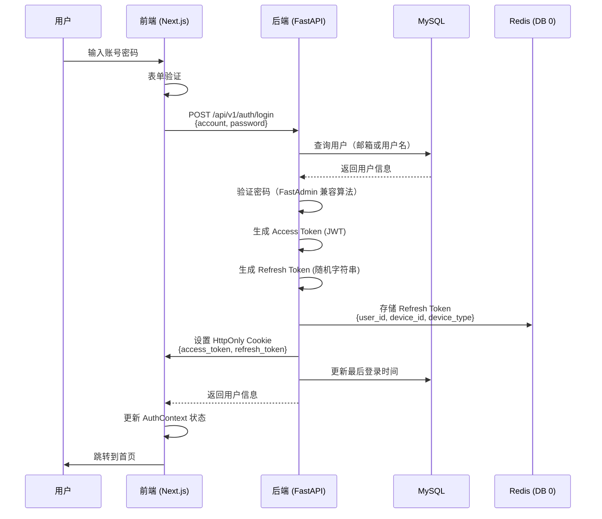
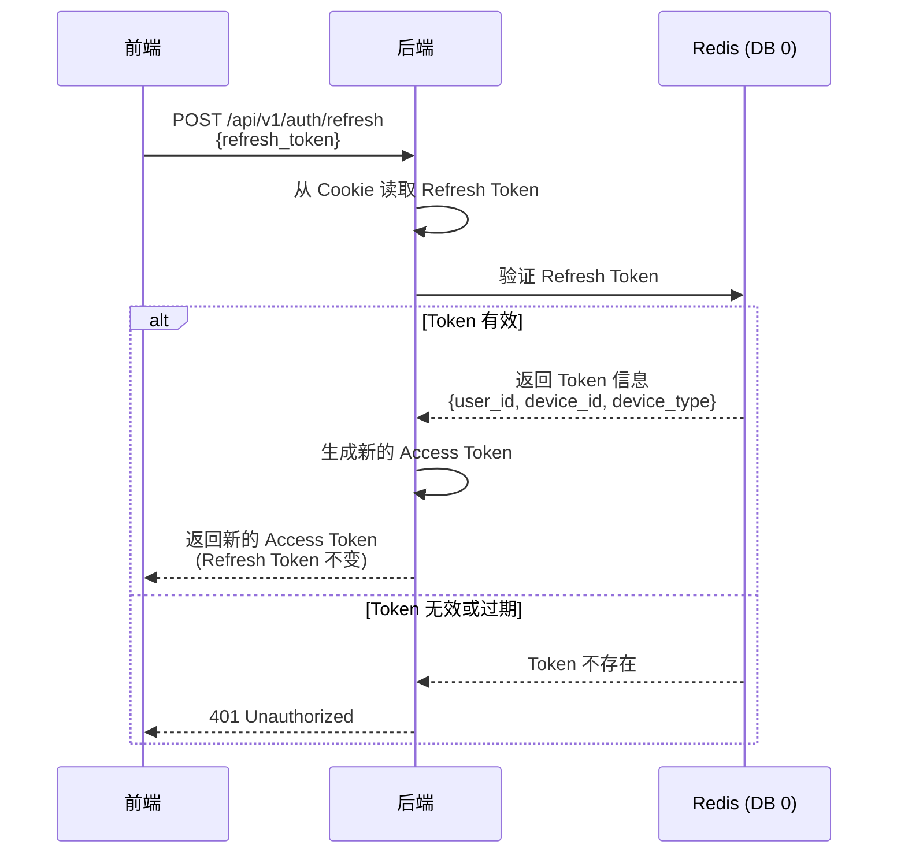
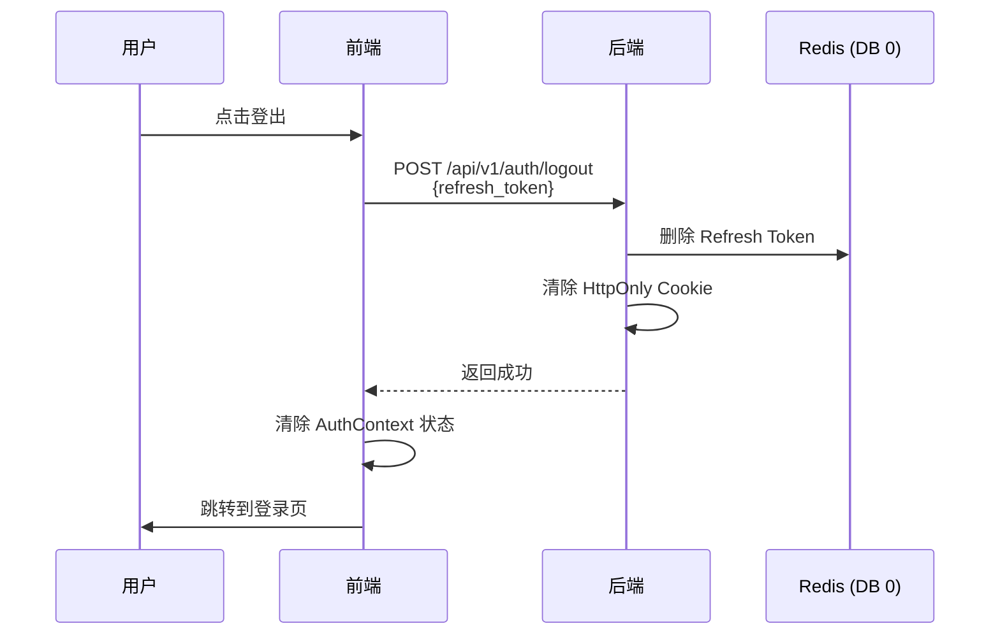
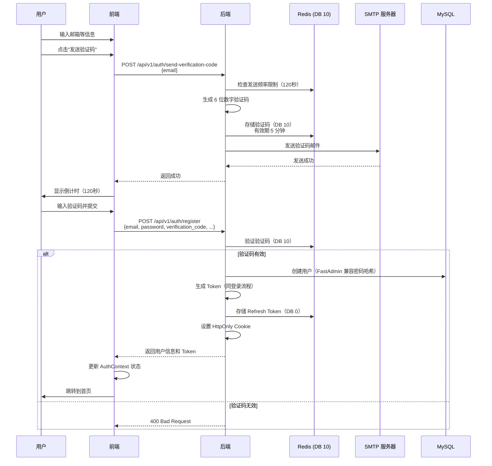
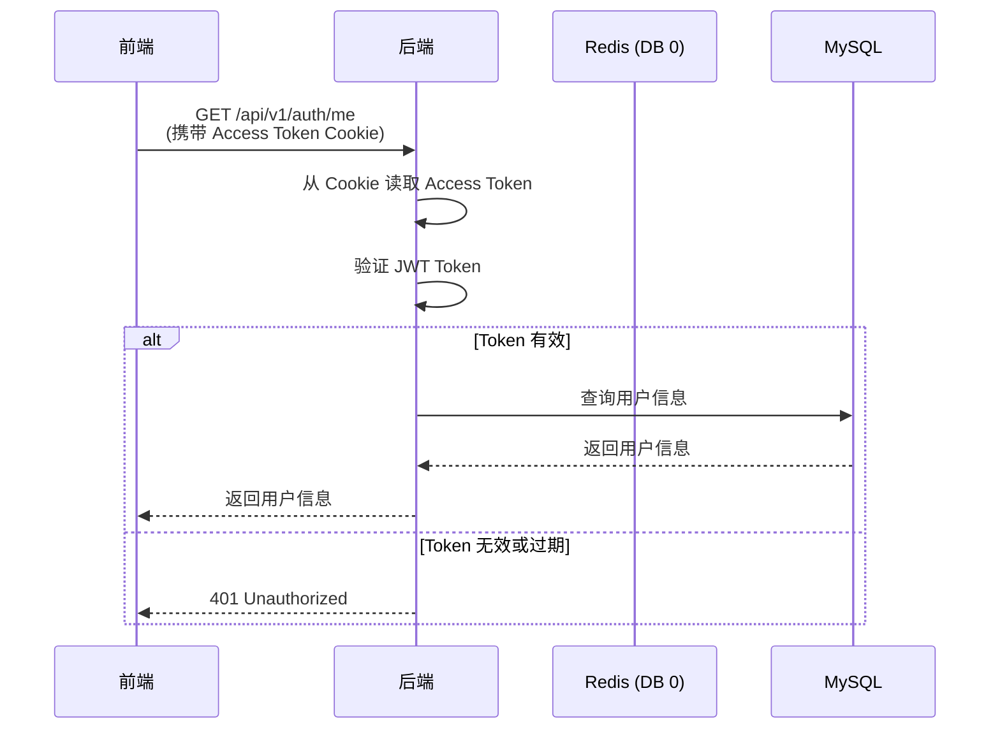

# 认证流程文档

本文档详细说明了 RimSurge 项目的认证系统架构和流程。

## 技术栈

- **前端**: Next.js 16 + React 19 + TypeScript
- **后端**: FastAPI + SQLAlchemy Core + Pydantic
- **数据库**: MySQL (`fa_user` 表)
- **缓存**: Redis
  - DB 0: Refresh Tokens
  - DB 10: Email Verification Codes
- **认证**: JWT (Access Token) + Random String (Refresh Token)
- **安全**: HttpOnly Cookies + HTTPS

## Token 存储机制

### Access Token
- **类型**: JWT (JSON Web Token)
- **存储**: HttpOnly Cookie
- **有效期**: 24 小时（默认）
- **用途**: 用于 API 请求的身份验证
- **特点**: 短期有效，包含用户 ID、设备 ID、设备类型等信息

### Refresh Token
- **类型**: 随机字符串（32 字节）
- **存储**: 
  - HttpOnly Cookie（客户端）
  - Redis DB 0（服务端）
- **有效期**: 30 天（默认）
- **用途**: 用于刷新 Access Token
- **特点**: 长期有效，支持服务端撤销

### 安全优势
- **HttpOnly Cookie**: 防止 XSS 攻击，JavaScript 无法访问
- **Redis 存储**: 支持服务端主动撤销 Token
- **HTTPS**: 传输加密，防止中间人攻击

## 登录流程



### 详细步骤

1. **用户输入**: 用户在前端登录页面输入账号（邮箱或用户名）和密码
2. **前端验证**: 前端进行基本的表单验证（非空、格式等）
3. **发送请求**: 前端通过 `POST /api/v1/auth/login` 发送登录请求
4. **后端验证**: 
   - 根据账号类型（包含 `@` 为邮箱，否则为用户名）查询用户
   - 使用 FastAdmin 兼容的密码哈希算法验证密码
   - 检查用户状态（必须为 `normal`）
5. **生成 Token**:
   - 生成设备 ID（32 字节随机字符串）
   - 生成 Access Token（JWT，包含用户 ID、设备 ID、设备类型）
   - 生成 Refresh Token（32 字节随机字符串）
6. **存储 Token**:
   - Refresh Token 存储到 Redis DB 0，键格式：`refresh_token:{token}`
   - Access Token 和 Refresh Token 设置到 HttpOnly Cookie
7. **更新用户信息**: 更新用户的最后登录时间和 IP
8. **返回响应**: 返回用户信息和 Token（Token 通过 Cookie 返回，响应体中也包含用于调试）
9. **前端处理**: 前端更新 AuthContext 状态，跳转到首页

## 刷新 Token 流程



### 详细步骤

1. **触发刷新**: Access Token 过期或前端检测到需要刷新
2. **发送请求**: 前端调用 `POST /api/v1/auth/refresh`，传递 Refresh Token
3. **验证 Token**: 
   - 后端从 Cookie 读取 Refresh Token（优先）或请求体
   - 从 Redis DB 0 查询 Token 信息
4. **生成新 Token**: 如果 Token 有效，生成新的 Access Token
5. **返回响应**: 返回新的 Access Token（Refresh Token 保持不变）

## 登出流程



### 详细步骤

1. **用户操作**: 用户点击登出按钮
2. **发送请求**: 前端调用 `POST /api/v1/auth/logout`，传递 Refresh Token
3. **删除 Token**: 后端从 Redis DB 0 删除 Refresh Token
4. **清除 Cookie**: 后端清除 HttpOnly Cookie（设置过期时间为过去）
5. **前端处理**: 前端清除 AuthContext 状态，跳转到登录页

## 注册流程（带邮箱验证）



### 详细步骤

#### 1. 发送验证码

1. **用户操作**: 用户输入邮箱地址，点击"发送验证码"按钮
2. **频率限制**: 后端检查同一邮箱是否在 120 秒内发送过验证码
3. **生成验证码**: 生成 6 位数字验证码
4. **存储验证码**: 验证码存储到 Redis DB 10，键格式：`verification_code:{email}`，有效期 5 分钟
5. **发送邮件**: 通过 SMTP 发送验证码邮件
6. **返回响应**: 返回成功，前端开始 120 秒倒计时

#### 2. 注册

1. **用户操作**: 用户填写注册表单（姓名、邮箱、密码、验证码等）
2. **前端验证**: 前端进行表单验证（邮箱格式、密码长度、验证码格式等）
3. **发送请求**: 前端调用 `POST /api/v1/auth/register`，传递注册信息
4. **验证验证码**: 后端从 Redis DB 10 验证验证码
5. **创建用户**: 
   - 使用 FastAdmin 兼容的密码哈希算法加密密码
   - 插入用户到 `fa_user` 表
6. **自动登录**: 注册成功后自动执行登录流程，生成 Token 并设置 Cookie
7. **返回响应**: 返回用户信息和 Token
8. **前端处理**: 前端更新 AuthContext 状态，跳转到首页

## 获取当前用户信息



### 详细步骤

1. **发送请求**: 前端调用 `GET /api/v1/auth/me`，自动携带 Cookie
2. **验证 Token**: 后端从 Cookie 读取 Access Token，验证 JWT 签名和有效期
3. **查询用户**: 从数据库查询用户信息
4. **返回响应**: 返回用户信息（不包含敏感信息如密码）

## 文件结构

### 前端文件

- `frontend/app/(app)/login/page.tsx` - 登录页面组件
- `frontend/app/(app)/register/page.tsx` - 注册页面组件
- `frontend/lib/api/auth.ts` - 认证相关 API 调用函数
- `frontend/lib/api/client.ts` - API 客户端封装（处理 Cookie、错误等）
- `frontend/lib/auth/context.tsx` - 认证状态管理 Context（React Context）
- `frontend/app/(app)/layout.tsx` - 应用布局（包含 AuthProvider）

### 后端文件

- `backend/api/app/api/v1/auth.py` - 认证路由（登录、注册、刷新、登出、验证码）
- `backend/api/app/api/v1/oauth.py` - OAuth 路由（微信小程序、Gmail 登录）
- `backend/api/app/core/security.py` - 密码哈希和 JWT 生成
- `backend/api/app/core/redis_client.py` - Redis 客户端（Refresh Tokens，DB 0）
- `backend/api/app/core/verification_code.py` - 验证码管理（Redis DB 10）
- `backend/api/app/core/email.py` - SMTP 邮件发送
- `backend/api/app/api/deps.py` - 依赖注入（从 Cookie 读取 Token）

## 安全注意事项

1. **密码安全**: 
   - 密码通过 HTTPS POST 请求传输（标准做法，安全可靠）
   - 前端代码中不输出明文密码，只输出 `passwordLength`（用于调试）
   - 后端使用 FastAdmin 兼容的密码哈希算法存储密码

2. **Token 安全**:
   - 使用 HttpOnly Cookie 防止 XSS 攻击
   - Refresh Token 存储在 Redis，支持服务端撤销
   - Access Token 短期有效（24 小时），降低泄露风险

3. **验证码安全**:
   - 验证码有效期 5 分钟
   - 同一邮箱每 120 秒只能发送一次
   - 验证码存储在使用后立即删除

4. **数据库安全**:
   - 使用参数化查询防止 SQL 注入
   - 密码使用哈希存储，不存储明文

## 常见问题

### Q: 为什么密码会在 Network 标签中显示？
A: 这是正常的 HTTPS POST 请求行为。密码通过 HTTPS 加密传输，只有客户端和服务器可以看到。这是标准的 Web 认证方式，安全可靠。

### Q: 为什么使用 HttpOnly Cookie 而不是 localStorage？
A: HttpOnly Cookie 可以防止 XSS 攻击，因为 JavaScript 无法访问。localStorage 中的 Token 可能被恶意脚本窃取。

### Q: Refresh Token 为什么存储在 Redis 而不是数据库？
A: Redis 支持过期时间自动删除，性能更好，适合存储临时数据。数据库表更适合存储需要长期保留的审计信息。

### Q: 如何撤销用户的 Token？
A: 从 Redis DB 0 删除对应的 Refresh Token 键即可。用户下次刷新 Token 时会失败，需要重新登录。

## 配置说明

### 环境变量（后端）

```bash
# JWT 配置
JWT_SECRET=your-secret-key
ACCESS_TOKEN_EXPIRE_HOURS=24
REFRESH_TOKEN_EXPIRE_DAYS=30

# Redis 配置
REDIS_HOST=redis
REDIS_PORT=6379
REDIS_PASSWORD=your-password

# SMTP 配置（验证码邮件）
SMTP_HOST=smtp.gmail.com
SMTP_PORT=587
SMTP_USER=your-email@gmail.com
SMTP_PASSWORD=your-app-password
SMTP_FROM_EMAIL=your-email@gmail.com
SMTP_FROM_NAME=RimSurge

# 验证码配置
VERIFICATION_CODE_EXPIRE_SECONDS=300  # 5 分钟
VERIFICATION_CODE_RATE_LIMIT_SECONDS=120  # 120 秒
```

### 环境变量（前端）

```bash
NEXT_PUBLIC_API_URL=http://localhost:8001/api/v1
```

## 更新日志

- **2025-12-16**: 
  - 移除 `fa_user_devices` 表依赖，只使用 Redis 存储 Refresh Tokens
  - 清理所有调试代码（console.log）
  - 创建认证流程文档
